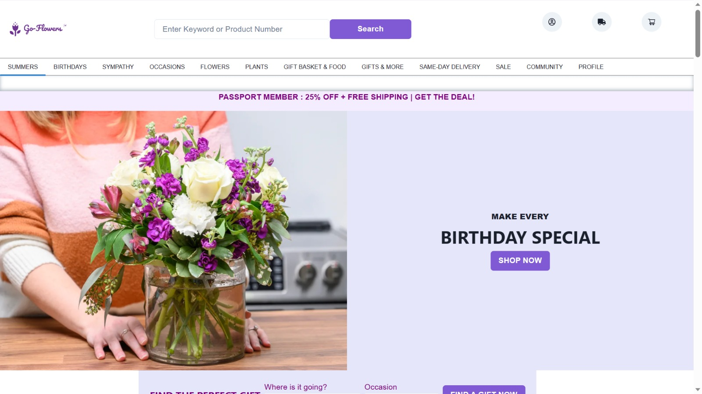
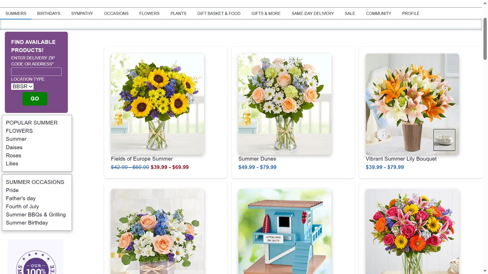
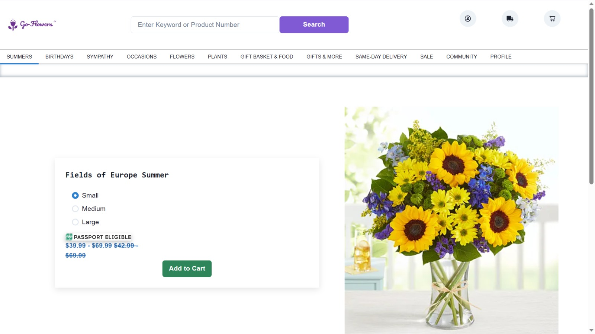
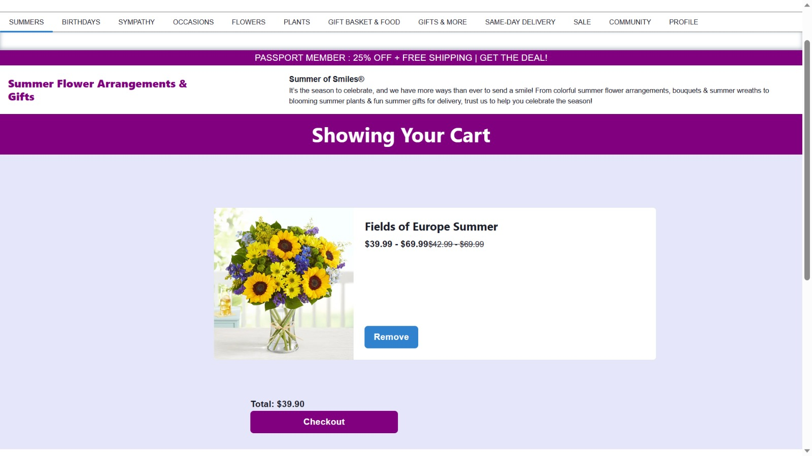
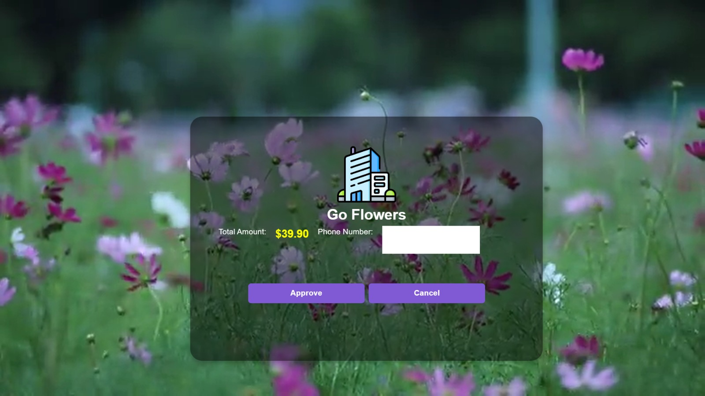
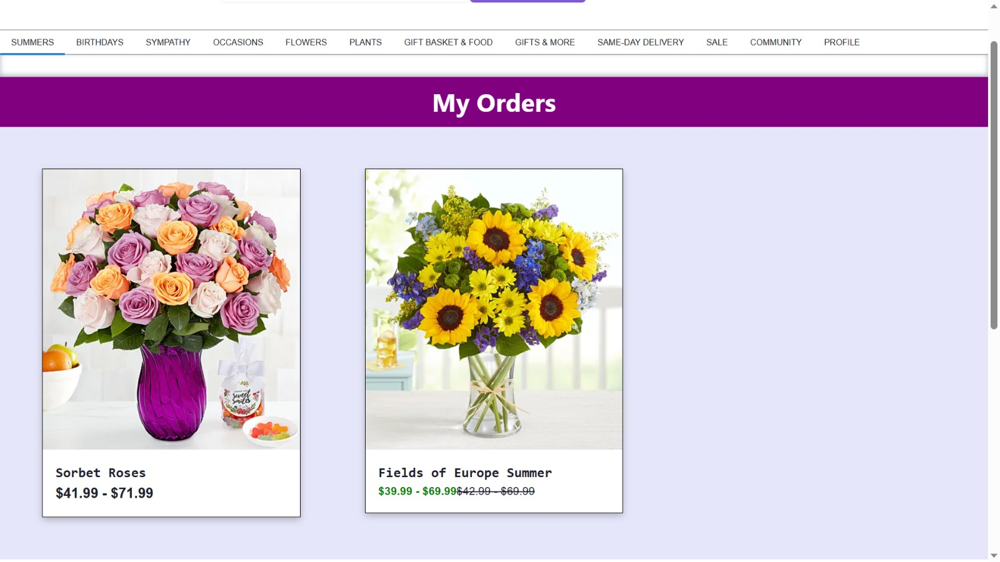

<h1 align="center">
  <br>
  <a href=""></a>
  <br>
  Go-Flowers
  <br>
</h1>

<h4 align="center">Blossom Your Moments.</h4>


<div align="center">
    <a href = "https://en.wikipedia.org/wiki/HTML">
        
    </a>
    <a href = "https://en.wikipedia.org/wiki/MongoDB">
        
    </a>
    <a href = "https://en.wikipedia.org/wiki/React_(software)">
        
    </a>
    <a href = "https://en.wikipedia.org/wiki/Node.js">
        
    </a>
    <a href = "https://en.wikipedia.org/wiki/Express.js">
        
    </a>
    <a href = "https://en.wikipedia.org/wiki/CSS">
        
    </a>
    <a href = "https://en.wikipedia.org/wiki/Npm">
        
    </a>
</div>

<p align="center">
  <a href="#introduction">Introduction</a> •
  <a href="#homepage">Homepage</a> •
  <a href="#item-collections">Item Collections</a> •
  <a href="#product-details">Product Details</a> •
  <a href="#cart">Cart</a> •
  <a href="#orders">Orders</a> •
  <a href="#payment">Payment Gateway</a> •
  <a href="#how-to-use">How to Use</a> •
  <a href="#contributors">Contributors</a>
</p>


## Introduction
<p>
Welcome to Go-Flowers! Where the enchanting world of flowers unfolds before your eyes. Immerse yourself in the beauty of nature's finest creations, thoughtfully curated and delicately arranged to add a touch of elegance to every moment. Whether you're celebrating a special occasion, expressing your heartfelt emotions, or simply indulging in the joy of gifting, BloomingTales offers a diverse array of exquisite blooms that speak volumes without words. Discover the language of flowers and let their timeless charm brighten your world. Step into our floral wonderland and embrace the artistry of nature, one petal at a time.
<p>


## Homepage


<h3>Select gifts as per your requirement</h3>

<p>- Lists the list of elements to assist the user to select the best product for their appropriate requirement.<br>- Items are categeorized based on occassions as well as seasonal collections.</p>


## Item Collections


<h3>Filtered List of Data</h3>
<p>
- List of filtered data is presented as per user's requirement.<br>
- The page also allows user to CHOOSE the respective products.<br>
- After select any product the user is redirected to their individual description page.<br>
</p>

## Product Details


<h3>Product Details</h3>
<p>
- Displays the details of each product along with their price.<br>
- The page also provides the option to select the size of the product.<br>
- The user is redirected to cart page after "Add to Cart" button is clicked.<br>
- All the details are minimal for easy comprehension for user and smooth UI/UX.<br>
<b><i>To visit cart page, the user must be logged in.</i></b>
</p>

## Cart


<h3>Cart</h3>
<p>
- Displays the list of items added by users.<br>
- The page also provides the option to remove the item or to checkout.<br>
- The user is redirected to payment page after "Checkout" button is clicked.<br>
</p>

## Payment Gateway


<h3>Cart</h3>
<p>
- A dummy payment gateway page.<br>
- The page provides option to Approve or Reject payment to stimulate realistic results.<br>
- The user is redirected to orders page after "Approve" button is clicked.<br>
</p>

## Orders


<h3>Orders</h3>
<p>
- The page displays list of items which checked out by user.<br>
- The page lists out the item details.<br>
- The page is cleared only after the item has been delivered to the user.<br>
</p>

## Sign in/Sign Up

<div style = "display:flex; flex-direction:row; flex-wrap:wrap;">
    
    
</div>

<p>
- Multipurpose box, which allows Sign in as well as Sign Up in the same page.<br>
- Uses React Hooks to implement state changes, which toggles Sign in/Sign Up form.<br>
- Allows new users to join and authenticates existing user.
<p>

## How to Use

<p>
  - To download the project. Git clone the project in your desktop.
  - Open any folder and type "cmd" in the address bar to open terminal. In the terminal enter
</p>

```npm
git clone https://github.com/no1Gangster/go-flowers.git
```

<p>
  - After Downloading. Install dependencies using

  ```npm
npm install
npm i json-server

```
</p>

<p>
 - Instead use this script to automatically install and launch complete project.

  ```npm
git clone https://github.com/no1Gangster/go-flowers.git
cd go-flowers
npm install
npm i json-server
npm start

```
</p>
  
## Contributors


>GitHub [@no1Gangster](https://github.com/no1Gangster) &nbsp;&middot;&nbsp;Backend<br>
>GitHub [@ADYASHA-2003](https://github.com/ADYASHA-2003) &nbsp;&middot;&nbsp;Frontend<br>

